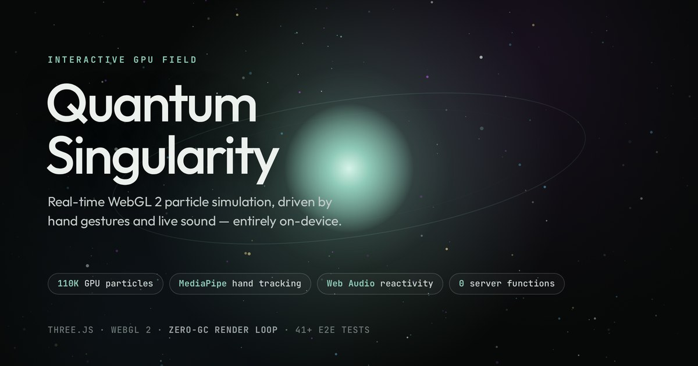

# Quantum Singularity

**A real-time WebGL 2 particle simulation you control with your hands and your voice — running entirely on-device, from a single static HTML file.**

[**▶ Live demo**](https://animation-zeta-rosy.vercel.app/) · [Architecture](./ARCHITECTURE.md) · [Changelog](./CHANGELOG.md) · [Validation report](./VALIDATION.md) · [MIT License](./LICENSE)



---

## What it is

Up to 110,000 GPU particles arranged into four mathematical topologies, rendered through an HDR bloom pipeline, driven by **three fused real-time input channels**:

| Input | Technology | What it does |
| :--- | :--- | :--- |
| **Pointer** | Raycast onto a world-space ground plane | Drag an attractor through the field |
| **Hand gestures** | MediaPipe Tasks Vision, on-device | Point to attract, open palm to control camera distance, Victory to add turbulence |
| **Live sound** | Web Audio API FFT, on-device | Bass swells the field, treble sharpens turbulence, detected beats fire a visual pulse |

Camera and microphone are both strictly opt-in, requested only on an explicit click, and neither stream ever leaves the browser.

**Press `B` in the live demo** for an in-app summary of the engineering decisions, or `P` for a live GPU-time and draw-call readout.

---

## Why it's interesting (engineering notes)

This is a computational-art piece, but the work that went into it is mostly systems work. A few decisions worth calling out:

### Positions are never computed on the CPU

There is no `position` buffer. Every particle's location is derived procedurally inside the vertex shader each frame from its index and a topology function (accretion disk, phyllotaxis lotus, 4D tesseract projection, strange attractor). Dropping the conventional `N × 3` attribute removed 1.3 MB of zeroes that were being uploaded to the GPU and bound on every draw.

Because each topology maps particle index monotonically to radius, an ordered buffer meant that lowering the draw range under load visibly lopped the outer edge off the disk. The index attribute is shuffled once at startup with a seeded Fisher–Yates, which decorrelates buffer order from spatial position — so quality reductions now thin the field uniformly and are essentially invisible.

### Time-based state, not frame-based

A `lerp(current, target, k)` applied once per frame converges twice as fast on a 120 Hz display as on a 60 Hz one, and crawls whenever a loop is throttled. Every easing, debounce, and smoothing path in the app — gesture hysteresis, camera distance, audio band smoothing, onset decay — runs through a frame-rate-independent exponential approach instead, so behaviour is identical at 30 Hz and 144 Hz. The gesture state machine's thresholds are expressed in **seconds**, not frame counts.

### Gesture recognition fuses two independent signals

The neural classifier (MediaPipe's trained `gesture_recognizer.task`) is fast and accurate on canonical poses but only knows a fixed label set. A hand-written geometric classifier — finger joint angles, PIP/DIP straightness, palm-basis normal quality, fingertip separation — is orientation-invariant and degrades gracefully. The two are blended with a **quality-weighted** rule where geometry's weight scales with how reliably the palm normal can be estimated, plus agreement boosts and a `None` veto from either source.

The result runs through a temporal state machine with separate activation / switch / hold / release thresholds, so a gesture can't flicker on a single-frame spike and can't be blocked from releasing by a flickering challenger.

### Audio reactivity is a peer, not a bolt-on

The microphone path mirrors the camera path exactly: explicit permission gate, session-counter guard against stale enable/disable races, named error messaging for every `getUserMedia` failure mode, and full teardown on tab hide, page unload, and bfcache persistence — on tab hide the camera/microphone are fully stopped, and re-acquired on return only if the visitor had them on. FFT bins are mapped to bass/treble Hz ranges once at connection time rather than every frame, and an adaptive onset detector uses a slow running average of bass energy as its noise floor — so beat detection works on a quiet podcast and a loud track alike, without a sensitivity slider.

### The render loop allocates nothing

Gesture ranking, temporal state updates, audio band analysis, and NDC mapping all write into pre-allocated scratch objects rather than returning new ones. DOM writes are change-gated. The result is zero per-frame garbage, so there are no collector pauses to show up as frame-time spikes.

### Quality adapts to the actual device, then to the actual frame time

Particle count, pixel ratio cap, and ML inference rate are tiered at boot from `deviceMemory`, `hardwareConcurrency`, and `saveData`, then adjusted live from measured frame time against a calibrated refresh rate — with a dead zone and cooldown so it settles instead of oscillating. Render targets are reallocated once per quality step, not twice.

### Correctness details that only show up under scrutiny

- **Phyllotaxis**: the golden angle is `2.39996…` radians. The shader was scaling `137.508°` by TAU, which is not the same constant and produced a subtly wrong spiral.
- **Grain**: additive noise applied to a linear HDR value becomes ±0.15 near black after the sRGB encode in `OutputPass`. Grain is applied in gamma-encoded space so it stays perceptually uniform instead of turning into blocky shadow noise.
- **Chromatic aberration & vignette**: both operate in aspect-corrected space, so "distance from centre" is a real radial distance rather than a UV-space ellipse stretched on wide displays.
- **Point size**: derived from `projectionMatrix[1][1]` and the drawing-buffer height, so perspective scaling is physically correct and tracks FOV and window size.
- **Draw-call profiling**: `EffectComposer` issues one `renderer.render()` per pass and `WebGLRenderer.info` auto-resets on each, so naively reading `info.render.calls` reports the last pass only. The render loop takes ownership of the reset to get an honest per-frame total.

---

## Testing

```bash
npm install
npx playwright install chromium
npm test        # static audit + full Playwright suite
```

| Suite | Covers |
| :--- | :--- |
| `gesture-recognition.spec.ts` | Geometry scoring per pose, score separation, scale invariance, palm-normal quality, malformed input, temporal activation/spike/release, challenger-flicker regression, frame-rate independence, fusion agreement and `None` veto, prototype-pollution resistance, NDC isotropy and mirroring |
| `audio-reactivity.spec.ts` | Band-bin mapping and clamping, band level extraction, adaptive onset firing and cooldown, idle UI state, full enable/disable round trip |
| `audio-bands-4.spec.ts` | Four-band DSP: bin boundaries, sub-bass blend, treble-only response, state keys |
| `engineering-panel.spec.ts` | Modal focus management, `inert` background isolation, mutual exclusion, live stat binding, GPU/draw-call readout and the multi-pass counting regression |
| `camera-pipeline.spec.ts` | Real camera-on flow headlessly with a fake device: model download and validation, WASM init, toggle round trip |
| `accessibility.spec.ts` | Keyboard shortcuts, ARIA state, guide overlay |
| `shader-compile.spec.ts` | GLSL3 post-processing pass compiles with no WebGL program errors — guards the `ShaderPass`/`glslVersion` regression |
| `topologies.spec.ts` | Hopf/Lorenz topology expansion, keyboard 5/6 + preset buttons, all-6 mapping |
| `url-state.spec.ts` | Hash serialization, invalid-hash tolerance, clipboard copy, HUD revert |
| `dom.spec.ts` · `gesture-state.spec.ts` · `webgl.spec.ts` | Interface structure, preset/palette state, WebGL 2 context, FPS HUD, focus mode |

The pure maths in both the gesture and audio pipelines is exposed through `window.__qsGesture` and `window.__qsAudio` test surfaces. That's deliberate: those are the only subsystems that can't be driven through the UI without a physical hand in front of a physical camera or real sound in the room. Pushing the side effects to the edges makes the interesting logic verifiable with synthetic landmark poses and synthetic frequency bins.

`scripts/static_audit.js` additionally checks ES module syntax, duplicate DOM IDs, `vercel.json` schema and headers, and `robots.txt`.

---

## Accessibility & resilience

- Full keyboard control (`H` guide, `B` engineering notes, `P` stats, `F` focus mode, `R` reset, `1–4` topologies, `Space` pause, `Esc` dismiss) with modifier keys never hijacked.
- Modals use a real focus trap with `inert` background isolation and focus restoration.
- Honours `prefers-reduced-motion` and `prefers-reduced-transparency`.
- Graceful degradation for: no WebGL 2, WebGL context loss and restore, no `EXT_color_buffer_float` (falls back from HDR to 8-bit targets), no GPU timer extension, CDN failure, offline, denied or missing camera/microphone, and `localStorage` being unavailable.

---

## Deployment

Static-only by design — no Vercel Functions, Middleware, Edge Functions, Blob storage, Image Optimization, or server-side AI. WebGL and MediaPipe inference run in the visitor's browser.

Deploy `index.html`, `vercel.json`, `robots.txt`, `sitemap.xml`, `manifest.json`, `og-image.jpg`, and the icon files from the repository root with Vercel's **Other** / static preset. No build command.

Why this shape:

- The app shell is a single HTML file; the favicon is a data URI, avoiding a separate request.
- Three.js and MediaPipe runtime files are loaded by the browser directly from pinned upstream CDNs rather than proxied, so they never consume Vercel bandwidth. Do **not** rewrite them through a Function — that converts browser-to-CDN traffic into Vercel Fast Data Transfer for no benefit.
- The 9 import-map modules are pinned with a Subresource Integrity hash in the import map (`sha384`, cross-verified against jsdelivr's published file hashes before use), so a compromised or MITM'd response for an already-allowed origin fails closed instead of executing. The MediaPipe WASM runtime and `.wasm` binary and the `gesture_recognizer.task` model are fetched by MediaPipe's own loader outside the import map, so they can't carry import-map integrity — they come from the same pinned CDN origin, and the model is additionally validated by magic bytes (TFL3/ZIP signature + size floor) and cached with poison eviction.
- The MediaPipe model is cached in browser `CacheStorage` after first load, with magic-byte validation and poison eviction.
- Camera permission is requested *before* the ML model downloads, so visitors who decline never pay the download cost.
- `vercel.json` restricts camera and microphone to the same origin and applies a CSP permitting only the exact external origins in use.
- `robots.txt` keeps search crawlers allowed while declining common model-training crawlers, and points to `sitemap.xml`.
- `manifest.json` + a maskable icon set make it installable as a standalone app on mobile and desktop.

Vercel Hobby is intended for personal/non-commercial projects; a portfolio demo fits that intent, and commercial use should move to the appropriate plan.

---

## Stack

Three.js `0.185.1` (pinned) · WebGL 2 · custom GLSL · MediaPipe Tasks Vision `0.10.35` (pinned) · Web Audio API · Playwright · zero runtime dependencies, zero build step.
